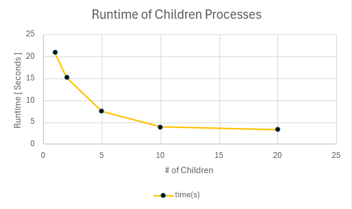
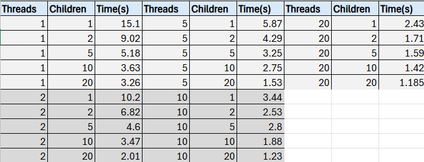

## Name: Braydon Section: 121

## System Programming Lab 11 Multiprocessing

In this task, I created revised the mandel.c file that now uses multiple child processes to generate frames for a Mandelbrot set animation. The program forks child processes based on the user input specifying the number of processes (e.g., 1, 2, 5, 10, or 20).Each child process invokes the mandel program to generate a single frame of the Mandelbrot set by modifying parameters such as the scale and origin slightly for each frame.

## Screenshots
Graph 1

Graph 2 

## Discussion
1.
The results show that increasing the number of child processes leads to a decrease in runtime. Initially, with 1 process, the program takes the longest time (21 seconds), while using 20 processes results in a much shorter runtime (3.3 seconds). This demonstrates the potential benefits of parallelism.
2.
a. A brief overview of your implementation of multiple threads.
- I implemented the use of a variable amount of threads to help create the images through splitting up the start locations of where each thread would start part of the image creating.
c. A brief discussion of your results. Answer the following questions:
i. Which technique seemed to impact runtime more – multithreading or multiprocessing. Why do
you think that is?
- Multiprocessing because initally it took more time to compile the images and with multithreading involved splitting the images into separate parts made it complie much faster. *Rely on table
ii. Was there a “sweet spot” where optimal (minimal) runtime was achieved?
- Anything under a second is pretty much hard to beat. Sweet spot would be around 1 second and a half. 

## Movie

